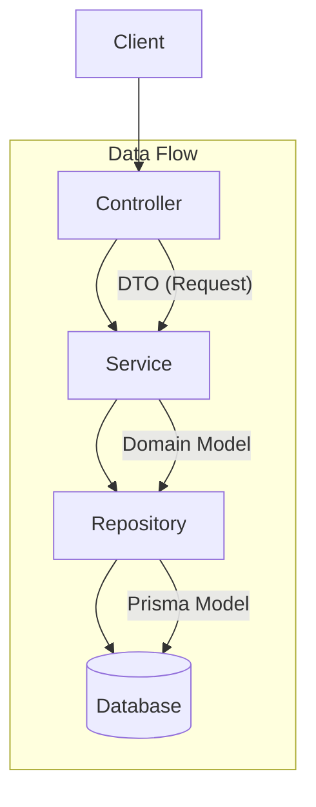

# 백엔드 개발 규칙 (Backend Conventions)

Nila Server는 **Plugin-Based Layered Architecture**를 따릅니다.
각 모듈(도메인)은 `DB -> Schema -> Repository -> Service -> Controller` 순서로 작성하며, 계층 간 관심사를 철저히 분리합니다.

## 1. 아키텍처 개요



## 2. 구현 순서 (Implementation Order)

새로운 기능을 추가하거나 모듈을 개발할 때는 **반드시** 아래 순서를 따릅니다.
한 번에 모든 파일을 생성하지 말고, 하위 계층부터 차근차근 구현하여 의존성을 확보하세요.

### Step 1: DB Layer (Prisma)
- **파일**: `prisma/schema.prisma`
- **역할**: 데이터 모델 정의.
- **작업**:
  1. `schema.prisma`에 모델을 정의합니다.
  2. `npx prisma migrate dev` 또는 `npx prisma db push`로 DB에 반영합니다.
  3. `npx prisma generate`로 클라이언트를 갱신합니다.

### Step 2: Schema/DTO Layer (TypeBox)
- **파일**: `src/types/schemas/user.schema.ts` (예시), `src/dtos/user/request.dto.ts` (예시)
- **역할**: API 요청/응답 검증 및 데이터 전송 객체 정의.
- **작업**:
  1. `@sinclair/typebox`를 사용하여 Validation Schema를 작성합니다.
  2. `Static<typeof Schema>`를 사용하여 DTO 타입을 추출합니다.
- **규칙**:
  - `request.dto.ts`: 요청 바디/쿼리 파라미터 타입.
  - `response.dto.ts`: 응답 바디 타입.

### Step 3: Repository Layer
- **파일**: `src/plugins/user/user.repository.ts` (예시)
- **역할**: 데이터베이스 접근 로직 추상화.
- **규칙**:
  - `PrismaClient`를 주입받아 생성(`createRepository` 패턴).
  - **비즈니스 로직 포함 금지**. 오직 DB CRUD만 수행.
  - 반환 타입은 Prisma가 생성한 모델 타입(`User`, `Post` 등)을 사용.

### Step 4: Service Layer
- **파일**: `src/plugins/user/user.service.ts` (예시)
- **역할**: 비즈니스 로직 수행.
- **규칙**:
  - `Repository`를 주입받아 생성(`createService` 패턴).
  - 여러 레포지토리를 조합하여 트랜잭션 처리 가능.
  - Controller에 의존하지 않음.
  - 에러 처리는 여기서 수행하거나, 커스텀 에러를 throw.

### Step 5: Controller Layer
- **파일**: `src/plugins/user/user.controller.ts` (예시)
- **역할**: HTTP 요청 처리 및 응답.
- **규칙**:
  - `Service`를 주입받아 생성(`createController` 패턴).
  - `FastifyRequest`, `FastifyReply` 객체 사용.
  - 요청 데이터를 DTO로 변환하여 서비스에 전달.
  - 서비스의 결과를 응답 DTO로 변환하여 클라이언트에 반환.

### Step 6: Plugin Registration
- **파일**: `src/plugins/user/index.ts` (예시)
- **역할**: 의존성 주입 및 라우트 등록.
- **작업**:
  - Repository -> Service -> Controller 순으로 인스턴스 생성 및 주입.
  - `fastify.decorate`로 서비스 등록 (필요 시).
  - 라우트 정의 (`fastify.get`, `fastify.post` 등).

## 3. 코드 작성 패턴 (Coding Patterns)

### Factory Pattern (의존성 주입)

모든 계층은 Factory 함수로 작성하여 테스트 용이성과 의존성 관리를 돕습니다.

```typescript
// repository.ts
export const createUserRepository = (prisma: PrismaClient) => ({
  findUser: (id: string) => prisma.user.findUnique({ where: { id } }),
});

// service.ts
export const createUserService = (userRepository: UserRepository) => ({
  getUser: (id: string) => userRepository.findUser(id),
});

// controller.ts
export const createUserController = (userService: UserService) => ({
  getUser: async (req, reply) => {
    const user = await userService.getUser(req.params.id);
    return reply.send(user);
  },
});
```

### Type Naming

- **Schema**: `UserSchema`, `CreateUserSchema` (PascalCase + Schema)
- **DTO**: `CreateUserRequest`, `UserResponse` (PascalCase + Request/Response)
- **Interface/Type**: `UserService`, `UserRepository` (PascalCase)

## 4. 금지 사항 (Anti-Patterns)

- ❌ **Controller에서 DB 직접 접근 금지**: 반드시 Service -> Repository를 거쳐야 함.
- ❌ **Service에서 `req`, `reply` 객체 사용 금지**: Service는 HTTP 문맥을 몰라야 함.
- ❌ **Repository에 비즈니스 로직 포함 금지**: 단순 CRUD만 수행.
- ❌ **순환 참조 주의**: Service가 다른 Service를 참조할 때는 신중하게 설계.
